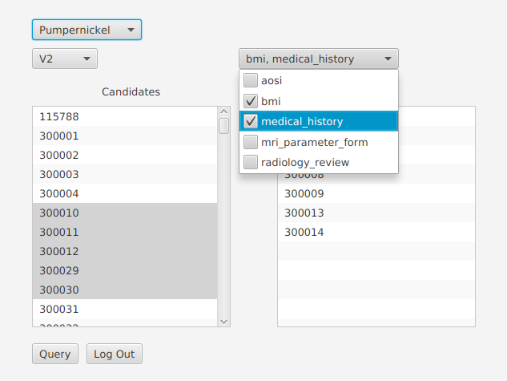

# Loris-API-Querier
Loris API Querier is a fully user-interfaced JavaFX program for querying LORIS-managed databases for data to be generated into a CSV file, using the v0.0.3 LORIS API. The program was written for use by my brother, a medical student at the University of Western Ontario.

## Use
The user will first specify the url for the LORIS instance to be used, then provide their login credentials to obtain a JWT key from the instance's API /login endpoint. The project structure will be queried, providing options for what candidates and test results should be queried. After the query has been run, the user will be provided the opportunity to select the relevant datapoints to generate into a CSV file.

## Release
Loris API Querier is currently in closed Alpha - the program is functional should you wish to compile it yourself, but a release binary has not been provided at this point.
