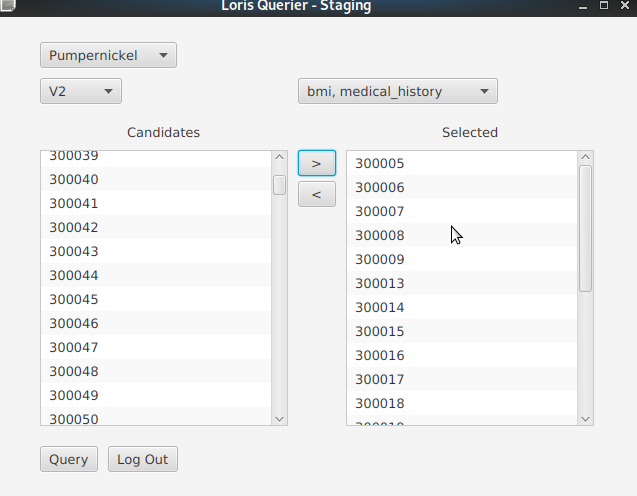

# Loris-API-Querier
Loris API Querier is a fully user-interfaced JavaFX program for querying LORIS-managed databases, using the v0.0.3 LORIS API. The program was written for use by my brother, a medical student at the University of Western Ontario.

